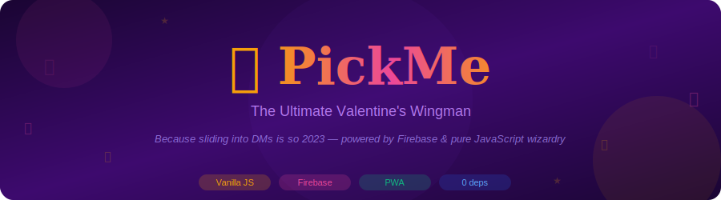
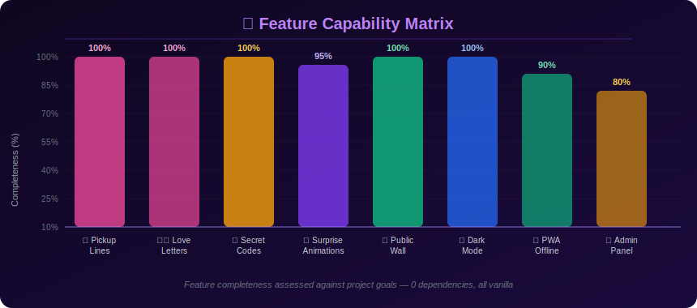
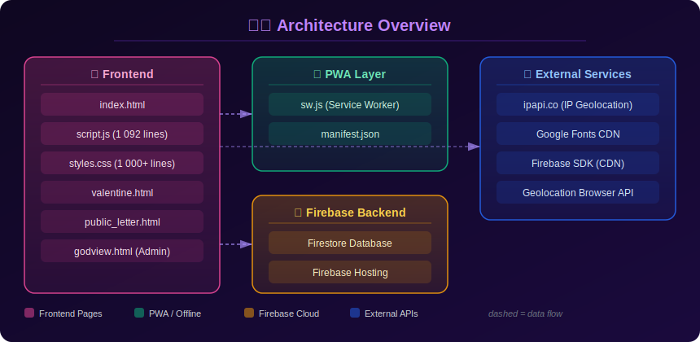
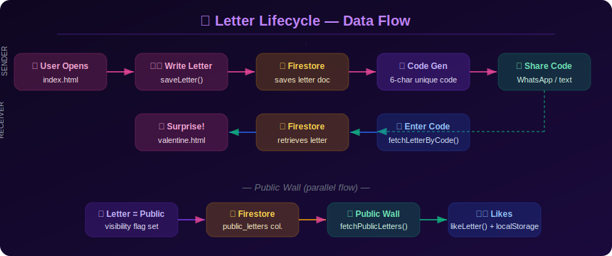
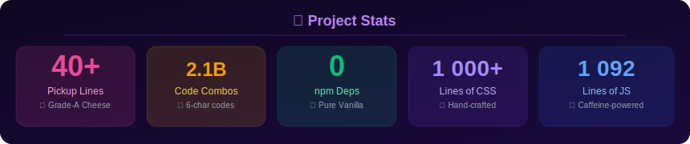

<div align="center">
  
</div>

---

<div align="center">

> *"They say love is in the air. We said — nah, let's put it in a Firestore document."*


---

## 🎯 What Even Is This?

It's 2026. Everyone's sliding into DMs with *"hey."* One. Word. No punctuation. No effort. The romance is dead.

PickMe is the defibrillator. ❤️‍🔥

It's a **romantic web app** (PWA-enabled, zero npm dependencies, pure vanilla everything) that lets you:

- 🎲 Generate 40+ certified-organic, grass-fed, artisanal pickup lines
- ✍️ Write personalized love letters up to 1,000 characters
- 🔐 Share letters via secret 6-character codes (2,176,782,336 combinations — you're unique, we promise)
- 💌 Send crushes a full animated surprise page with floating hearts, rose petals, and typewriter magic
- 🌍 Browse a public wall of love letters (sorted by newest, oldest, most liked, or sender A–Z)
- ❤️ Like letters, share via WhatsApp, track public confessions

Built with Vanilla JS, Firebase Firestore, and the power of caffeine. No React. No webpack. Just vibes and `document.getElementById`. 

---

## 🎬 Live Demo / In Action

> **Place demo GIF here:** `assets/demo.gif`


*The GIF above should show: app opening → pickup line spinning → typing a letter → secret code generation → animated surprise page reveal. Keep it under 5 MB please, we're not animals.*

---

## 🗺️ System Overview

PickMe is a **client-heavy, serverless PWA**. There's no backend code you write — Firebase handles the database. The app runs entirely in the browser, caches with a Service Worker, and gracefully degrades when offline.

| Layer | What it does |
|-------|-------------|
| **Frontend** | Pure HTML5/CSS/JS — all the UI, animations, forms, modals |
| **PWA Layer** | `sw.js` + `manifest.json` — offline caching, installable on home screen |
| **Firebase Firestore** | Cloud NoSQL database — stores letters, public wall, like counters |
| **Firebase Hosting** | Serves the static files to the world |
| **External APIs** | `ipapi.co` for IP geolocation, Google Fonts CDN, Firebase JS SDK (CDN) |

No Docker. No CI pipeline. No microservices. Just a single `public/` folder that contains the entire universe of the app.

---

## ✨ Features

### 🎲 Pickup Line Generator
40+ cheesy, nerdy, self-aware pickup lines. Press **Space** or **Enter** to spin the wheel. Each one appears with a typewriter animation because everything is more dramatic that way.

> *"Are you a Wi-Fi signal? Because I'm really feeling a connection."* 📶

### ✍️ Love Letter Creator
Write personalized Valentine's messages (up to 1,000 characters — be concise, Shakespeare). Add sender and receiver names. Choose public or private visibility. Hit send and watch the magic happen.

### 🔑 Secret Code System
Each letter gets a **unique 6-character alphanumeric code** (alphanumeric, excludes 0/O/I/L to avoid confusion — details matter). Share it. They enter it. Surprise.

2,176,782,336 possible combinations. You're statistically special.

### 🎉 Animated Surprise Page
`valentine.html` is the payoff. Floating rose petals. Beating hearts. Smooth typewriter reveal. It's so over-the-top romantic that even your pet might look uncomfortable.

### 🌍 Public Wall
`public_letter.html` + `fetchPublicLetters()` pulls all public letters from Firestore and renders them in a sorted, searchable wall. Sort by newest, oldest, most liked, sender A–Z, or recipient A–Z.

### ❤️ Like System
Tap the heart button. `localStorage` tracks what you've liked (no double-voting, we're not animals). Counter lives in Firestore. Atomic-ish.

### 📤 WhatsApp Share
One-click share button generates a pre-formatted WhatsApp message with the secret code. Because everyone uses WhatsApp and this isn't 2010.

### 🌙 Dark Mode
`localStorage`-persisted theme toggle. Light mode for optimists. Dark mode for realists. Both look good.

### 🔒 Password-Protected Admin
`godview.html` is a password-protected analytics dashboard. It shows all letters, locations, metadata. Useful for the developer. Not for your average user.

### 📍 Location Tracking
Letters capture IP address, city, country, timezone, and optionally GPS coordinates (if permission granted). Analytics purposes only. See the [Privacy](#-privacy) section.

### 📦 PWA / Offline Support
`sw.js` implements network-first for API calls, cache-first for static assets. The app works without a network connection (minus the Firebase-dependent features, obviously).

---

## 🧠 Capability Visualization

<div align="center">
  
</div>

---

## 🏗️ Architecture Diagram

<div align="center">
  
</div>

---

## 🔄 Data Flow

<div align="center">
  
</div>

---

## 🚀 Installation

### Prerequisites
- Git
- A browser (Chrome, Firefox, Edge — any modern one)
- Python 3 or Node.js for local serving (or just open the file directly, no judgment)
- A Firebase project **(optional — the app works without it, just no cloud persistence)**

### Steps

```bash
# 1. Clone this repo
git clone https://github.com/Kaelith69/pickme.git
cd pickme

# 2. Serve locally (pick your poison)
python -m http.server 8000 --directory public
# or
npx serve public

# 3. Open http://localhost:8000 in your browser
```

That's it. No `npm install`. No `build` step. No waiting 4 minutes for webpack. It just works. ✨

### Firebase Setup (Optional)

If you want actual cloud persistence:

1. Go to [Firebase Console](https://console.firebase.google.com/) and create a project
2. Enable **Firestore Database** in test mode
3. Replace the Firebase config object at the top of `public/script.js` with your own config
4. Deploy to Firebase Hosting: `firebase deploy`

The app already includes Firestore security rules in `firestore.rules`.

---

## 📖 Usage

### Sender Flow

1. Open the app at `public/index.html`
2. Click through the pickup line generator (Space/Enter to cycle — keyboard shortcut included, you're welcome)
3. Click **Write a Letter**
4. Fill in your name, their name, your message (1,000 chars max)
5. Choose Public or Private
6. Click Send → you get a **6-character secret code**
7. Share that code (WhatsApp button included, or copy-paste it like a caveman, your choice)

### Receiver Flow

1. Open the app
2. Click **Read a Letter**
3. Enter the secret code
4. Watch the animated surprise page load
5. Try not to cry (we can't help you with this part)

### URL Parameter

Letters can be opened directly via:
```
https://yourapp.com/?code=ABCDE1
```

Great for links in DMs, texts, or QR codes if you're extra.

---

## 📁 Project Structure

```
pickme/
├── public/
│   ├── index.html          # Main app UI
│   ├── valentine.html      # Animated surprise page (the money shot)
│   ├── public_letter.html  # Public letter wall template
│   ├── godview.html        # Admin analytics dashboard
│   ├── script.js           # All the logic (1,092 lines of love)
│   ├── styles.css          # Design system (1,000+ lines, hand-crafted)
│   ├── sw.js               # Service Worker (offline magic)
│   └── manifest.json       # PWA manifest
├── assets/                 # Docs SVGs and demo GIF (add your demo.gif here)
├── wiki/                   # GitHub Wiki source files
├── firebase.json           # Firebase Hosting config
├── firestore.rules         # Firestore security rules
├── firestore.indexes.json  # Firestore composite indexes
├── .firebaserc             # Firebase project binding
├── current-config.txt      # Reference Firebase config (do not commit real credentials)
├── README.md
├── LICENSE
├── CONTRIBUTING.md
├── CHANGELOG.md
└── SECURITY.md
```

---

## 📊 Performance Stats

<div align="center">
  
</div>

---

## 🔏 Privacy

PickMe collects location data when you submit a letter. Specifically:

- **IP address** — from the `ipapi.co` API call
- **City, country, timezone** — inferred from IP
- **GPS coordinates** — only if you grant browser geolocation permission

This data is stored in Firestore alongside your letter and is **visible to the admin panel** (`godview.html`). It is **not shown publicly** to other users.

If you're running your own instance: you can remove the `getIPAndLocation()` call from `script.js` to disable tracking entirely.

For the full privacy breakdown, see the [Wiki: Privacy page](wiki/Privacy.md).

---

## 🗺️ Future Roadmap

- [ ] 🎨 Custom letter themes / sticker packs
- [ ] 📧 Email delivery option
- [ ] 🔒 End-to-end encrypted letters
- [ ] 🌐 i18n / translation support (love is universal)
- [ ] 📱 Dedicated mobile app (Capacitor/PWA wrapper)
- [ ] 🤖 AI-generated pickup lines via API
- [ ] 🔔 Push notifications ("someone liked your letter!")
- [ ] 🎵 Background music option for the surprise page

PRs welcome. See [CONTRIBUTING.md](CONTRIBUTING.md).

---

## 📜 License

MIT — see [LICENSE](LICENSE). Do whatever you want with it, just don't blame us if your pickup line fails IRL. 💔

---

<div align="center">

### ⭐ Star this repo if you found love (or at least a good laugh)

[Report Bug](https://github.com/Kaelith69/pickme/issues) · [Request Feature](https://github.com/Kaelith69/pickme/issues) · [CONTRIBUTING](CONTRIBUTING.md) · [Wiki](wiki/Home.md)

*Made with 💝 by someone who probably needs to touch grass*

*Last Updated: February 2026*

</div>
